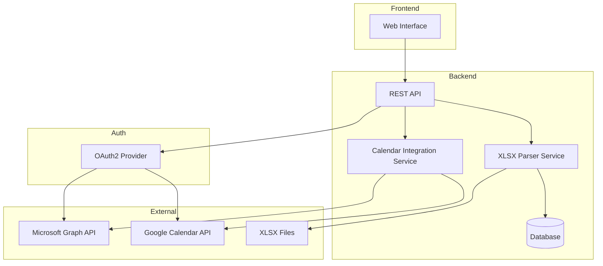

- Diagram

```mermaid
flowchart TD
    subgraph Frontend
        UI[Web Interface]
    end

    subgraph Backend
        API[REST API]
        XLSXProcessor[XLSX Parser Service]
        CalendarService[Calendar Integration Service]
        DB[(Database)]
    end

    subgraph Auth
        OAuth[OAuth2 Provider]
    end

    subgraph External
        MSGraph[Microsoft Graph API]
        GoogleCal[Google Calendar API]
        XLSX[XLSX Files]
    end

    UI --> API
    API --> XLSXProcessor
    API --> CalendarService
    XLSXProcessor --> DB
    CalendarService --> MSGraph
    CalendarService --> GoogleCal
    API --> OAuth
    OAuth --> MSGraph
    OAuth --> GoogleCal
    XLSXProcessor --> XLSX
``` 
